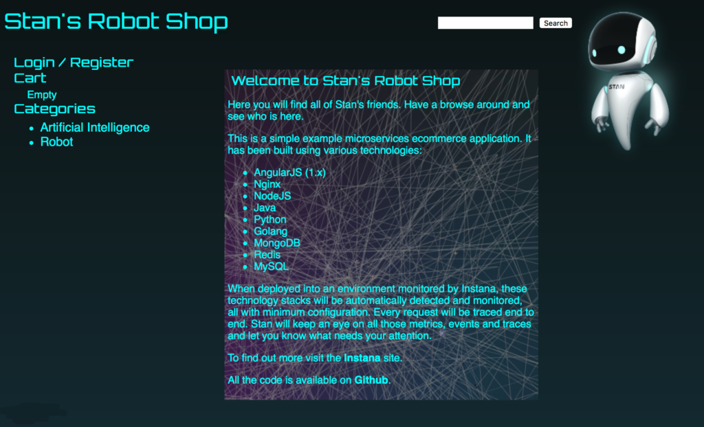
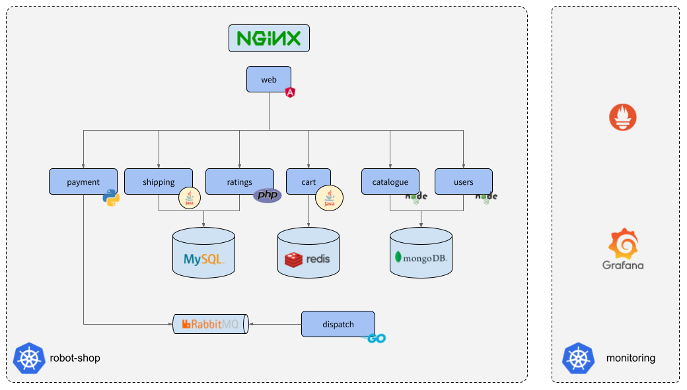
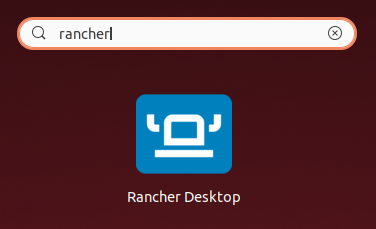
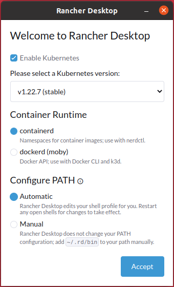
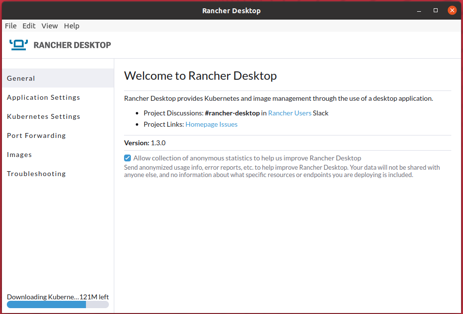
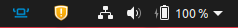
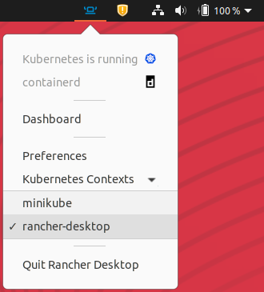

id:     app-setup
Title:  SRE Academy - Configuração da Aplicação

# SRE Academy - Configuração da Aplicação (Robot Shop)

Projeto utilizado para guiar os colaboradores da CI&T a aprender mais sobre as práticas de SRE (Site Reliability Engineering).

## Aplicação base

### Robot Shop

Para a visualização das principais métricas de confiabilidade defendidas por práticas de SRE, utilizaremos o benchmark do Stan's Robot Shop.

[Stan's Robot Shop](https://github.com/instana/robot-shop/)



A aplicação consiste em um e-commerce de robôs, e por meio dela será possível monitorar os serviços utilizados desde a visualização da lista de robôs disponíveis para venda e adição no carrinho de compras até o checkout e geração do pedido.

### Diagrama de Arquitetura



#### Tecnologias

- [AngularJS (1.x)](https://angularjs.org/)
- [Golang](https://go.dev/)
- [Java](https://www.java.com/pt-BR/) ([Spring Boot](https://spring.io/))
- [MongoDB](https://www.mongodb.com/)
- [MySQL](https://www.mysql.com/) ([Maxmind](https://www.maxmind.com/en/home) data)
- [Nginx](https://www.nginx.com/)
- [NodeJS](https://nodejs.org/en/) ([Express](https://expressjs.com/))
- [PHP](https://www.php.net/) ([Apache](https://httpd.apache.org/))
- [Python](https://www.python.org/) ([Flask](https://flask.palletsprojects.com/en/2.1.x/) e [Locust](https://locust.io/))
- [RabbitMQ](https://www.rabbitmq.com/)
- [Redis](https://redis.io/)

## Instalação do Rancher Desktop

### Linux

Faremos a instalação via pacote .deb.

Faça o download da chave GPG do Rancher.
``` console
curl -s https://download.opensuse.org/repositories/isv:/Rancher:/stable/deb/Release.key | gpg --dearmor | sudo dd status=none of=/usr/share/keyrings/isv--rancher-stable-archive-keyring.gpg
```

Adicione o repositório do Rancher à lista dos repositórios disponíveis no seu sistema.
```console
echo 'deb [signed-by=/usr/share/keyrings/isv--rancher-stable-archive-keyring.gpg] https://download.opensuse.org/repositories/isv:/Rancher:/stable/deb/ ./' | sudo dd status=none of=/etc/apt/sources.list.d/isv-rancher-stable.list
```

Atualize a lista de pacotes do seu sistema.
``` console
sudo apt update
```

Instale o Rancher Desktop.
``` console
sudo apt install rancher-desktop
```

### Windows

Acesse [https://rancherdesktop.io/](https://rancherdesktop.io/) e baixe o instalador para Windows.

Execute o instalador e aceite o acordo de licença.

## Configuração do Rancher Desktop

Abra o Rancher desktop.



Na tela de boas-vindas, verifique se está selecionada a versão "stable" do Kubernetes, "containerd" e "Automatic" e clique em Accept.

**Obs.:** No **Windows**, selecione "dockerd (moby)" como *Container Runtime*.



O Kubernetes ([K3s](https://k3s.io/)) será instalado. Você pode acompanhar o progresso no canto inferior esquerdo da janela do Rancher.



Verifique a bandeja do seu sistema (system tray) se o ícone do Rancher Desktop está presente.



Clique no ícone do Rancher Desktop e verifique em Kubernetes Contexts se o rancher-desktop está selecionado.



## Helm

Instalação da aplicação no Kubernetes via Helm.

Crie o namespace robot-shop no Kubernetes.
``` console
kubectl create ns robot-shop
```

Instale a aplicação.
``` console
helm install robot-shop --create-namespace -n robot-shop robot-shop/K8s/helm/
```
