id:     monitoring
Title:  SRE Academy - Monitoramento

# SRE Academy - Monitoramento

## Monitoramento (Prometheus e Grafana)

Deploy da stack de Monitoramento no Kubernetes.

Acesse o diretório monitoring a partir da raiz do projeto.
``` console
cd robot-shop/K8s/monitoring
```

Crie o namespace monitoring.
``` console
kubectl create namespace monitoring
```

Crie o role prometheus para gerenciar o namespace monitoring.
``` console
kubectl create -f k8s-prometheus/clusterRole.yaml
```

Configuração do prometheus no cluster Kubernetes.
``` console
kubectl create -f k8s-prometheus/config-map.yaml
```

Crie o deployment do prometheus.
``` console
kubectl create -f k8s-prometheus/prometheus-deployment.yaml --namespace=monitoring
```

Crie o service do prometheus.
``` console
kubectl create -f k8s-prometheus/prometheus-service.yaml --namespace=monitoring
```

Aplique algumas métricas nos recursos do Kubernetes.
``` console
kubectl apply -f kube-state-metrics/
```

Crie os recursos do Grafana
``` console
kubectl create -f k8s-grafana/
```

## Logging (Loki)

Deploy da stack de Log no Kubernetes.

Adicione o repositório do Grafana ao Helm.
``` console
helm repo add grafana https://grafana.github.io/helm-charts
```

Instale o loki no namespace monitoring.
``` console
helm install loki grafana/loki-stack --namespace monitoring --create-namespace --set grafana.enabled=true
```

## Usabilidade Rancher Desktop

Clique no ícone do Rancher Desktop na bandeja do sistema e selecione "Dashboard".

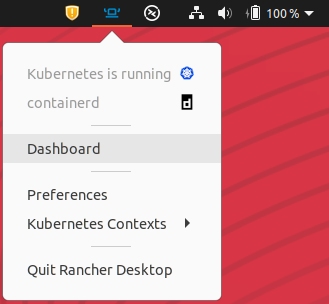
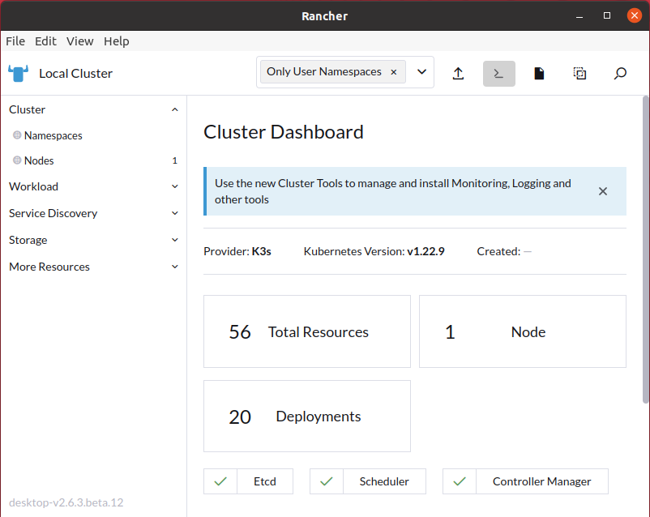

Selecione, no menu lateral esquerdo, "Workload" e "Pods" para visualizar os Pods em execução.

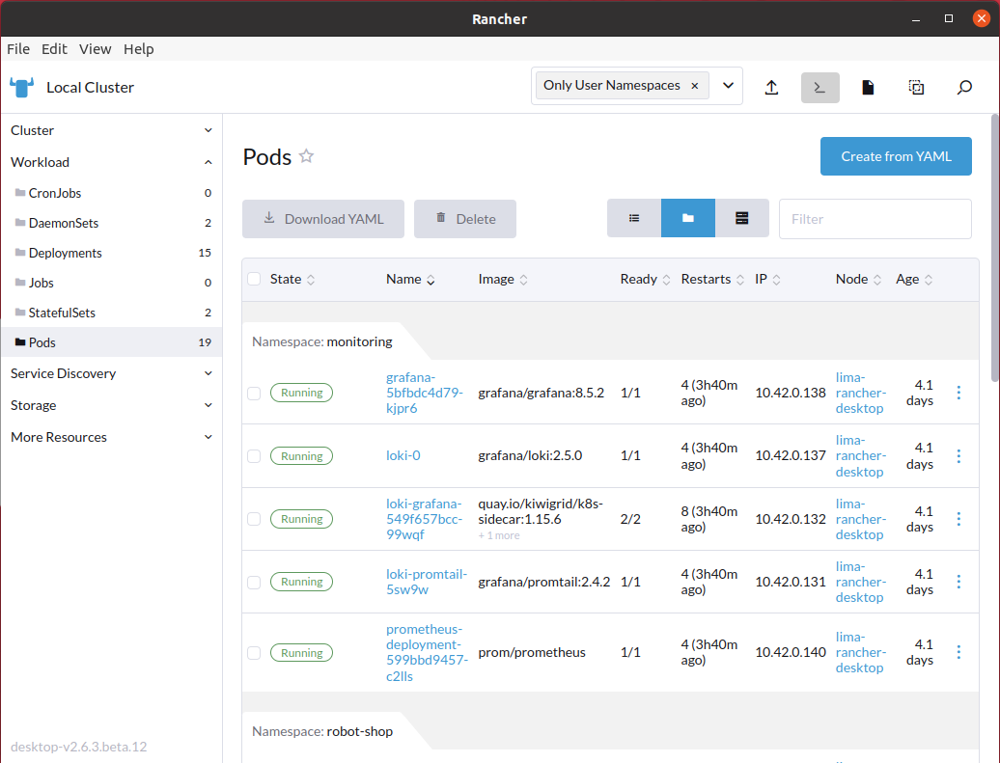

Caso algum dos Pods não tenha sido inicializado corretamente, vá na linha do Pod com problema e no canto direito da janela clique nos três pontos verticais e selecione "Delete".

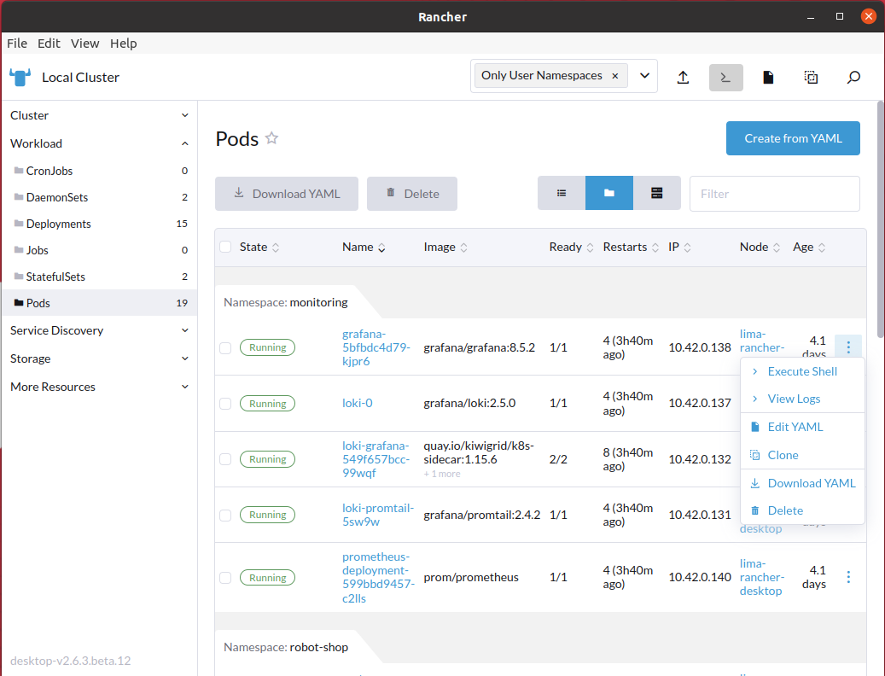

Confirme a deleção. Logo após o Service Discovery irá iniciar outro Pod baseado na mesma imagem. Caso o problema persistir, execute o comando `kubectl logs -f {{POD_ID}} -n robot-shop` e altere `{{POD_ID}}` pelo nome do Pod, encontrado na coluna "Name" no "Dashboard" do Rancher. O log deve auxiliar na correção do problema.

## Grafana

Configuração do Grafana.

Clique no ícone do Rancher Desktop que se encontra na bandeja do sistema e selecione "Preferences".

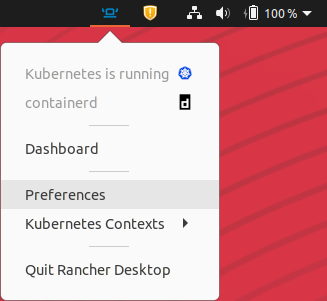

Selecione "Port Forwarding" no menu lateral esquerdo.

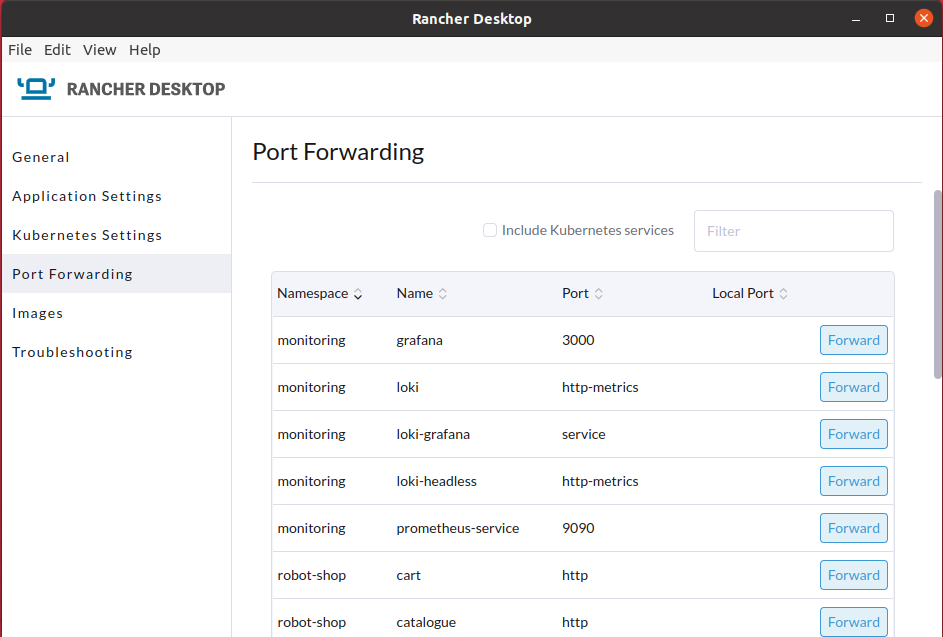

Clique em "Forward" nos serviços "grafana", "prometheus-service" e "web". Será gerada uma porta, na coluna "Local Port", para que você acesse os serviços localmente em seu navegador.

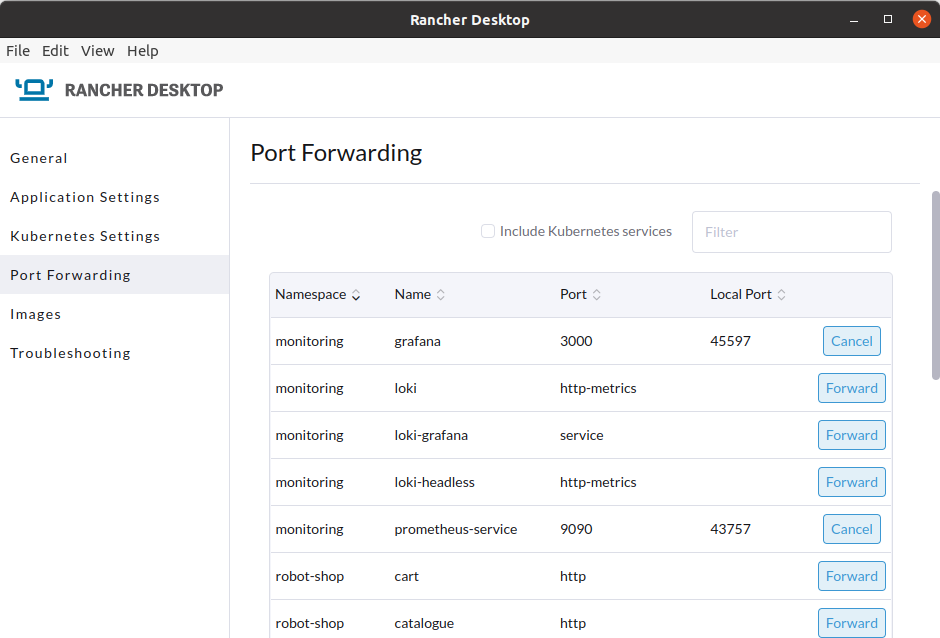

Acesse o Grafana em seu navegador, na porta que você acabou de gerar, com o endereço `localhost:{{Local Port}}`.

Faça login com o usuário `admin` e senha `admin`. Logo após, defina uma nova senha. **Obs.:** Será necessário redefinir a senha toda vez que você deletar o pod do Grafana.

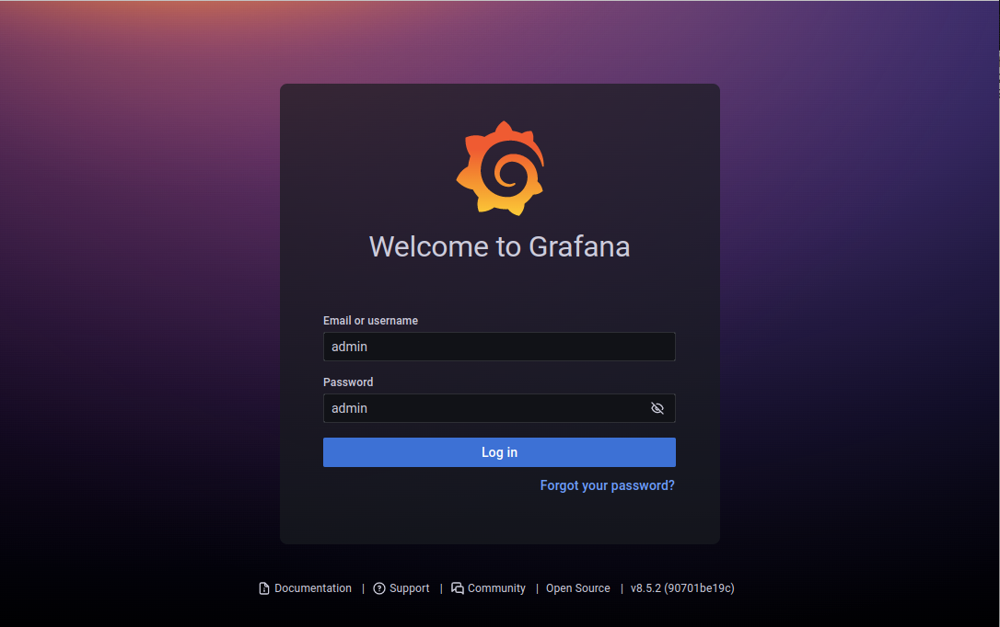

No menu lateral esquerdo, vá no ícone da engrenagem e selecione "Data sources".

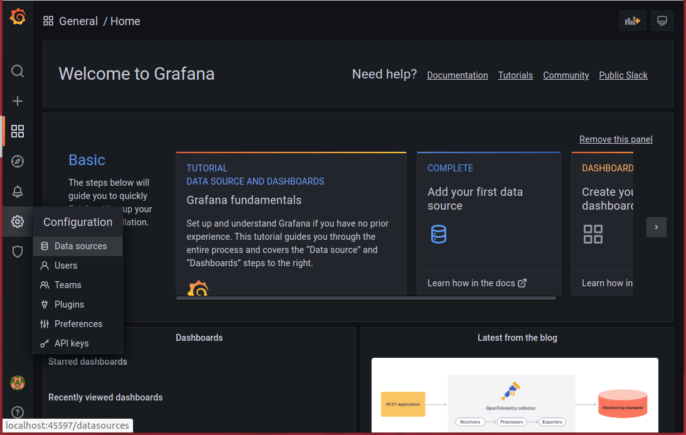

Selecione "Add data source".

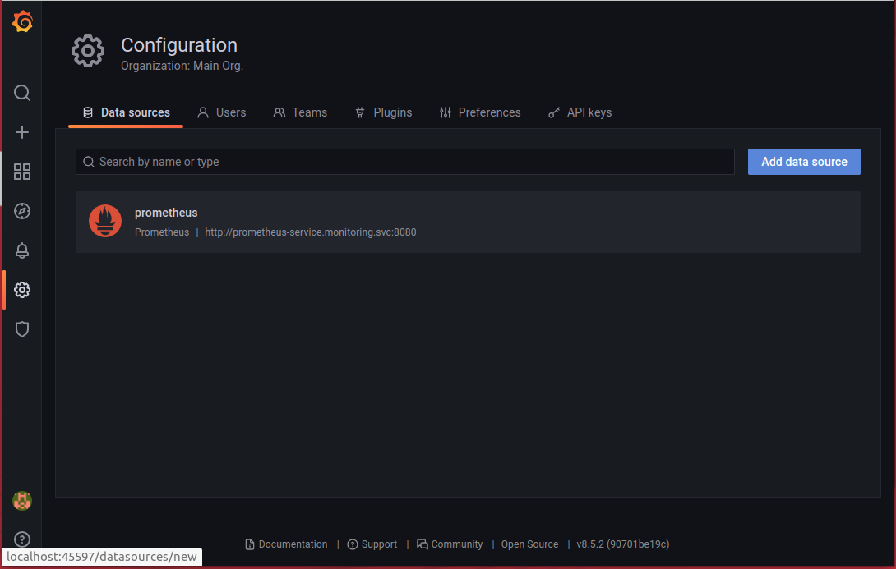

Selecione "Loki".

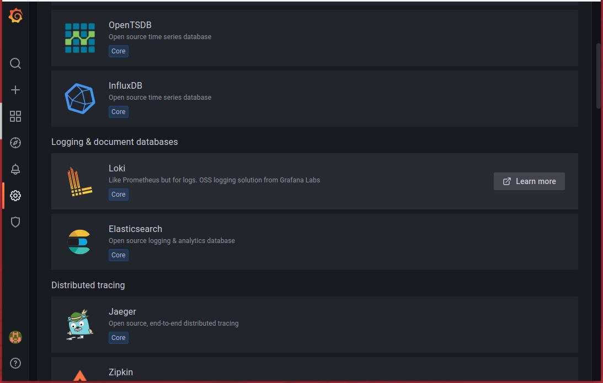

Configure o Loki alterando sua URL para `http://loki.monitoring:3100`.

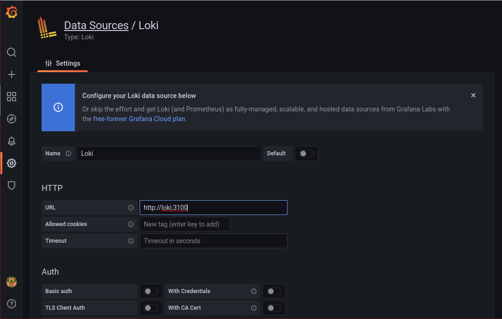

Clique em "Save & test" no final da página.

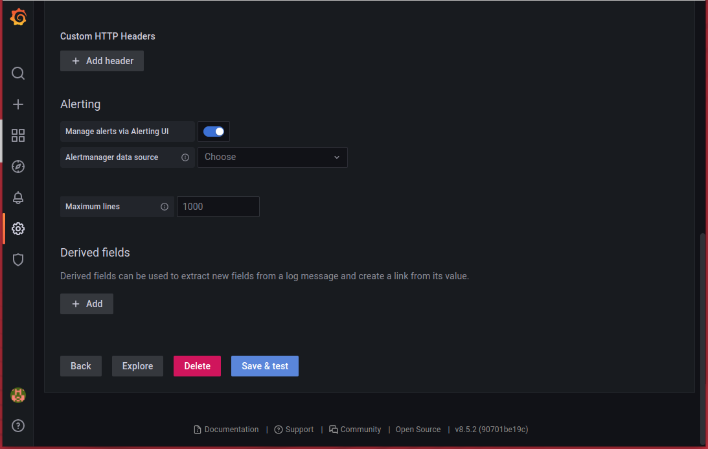

No menu lateral esquerdo, vá no ícone de "mais"/"adição" (+) e selecione "Import".

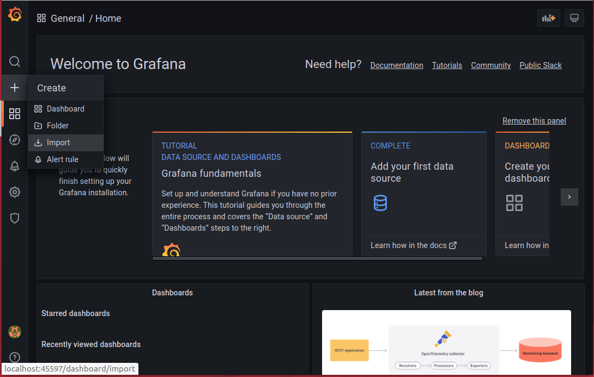

Digite "12740" em "Import via grafana.com" e clique em "Load" para importar o dashboard do Kubernetes.

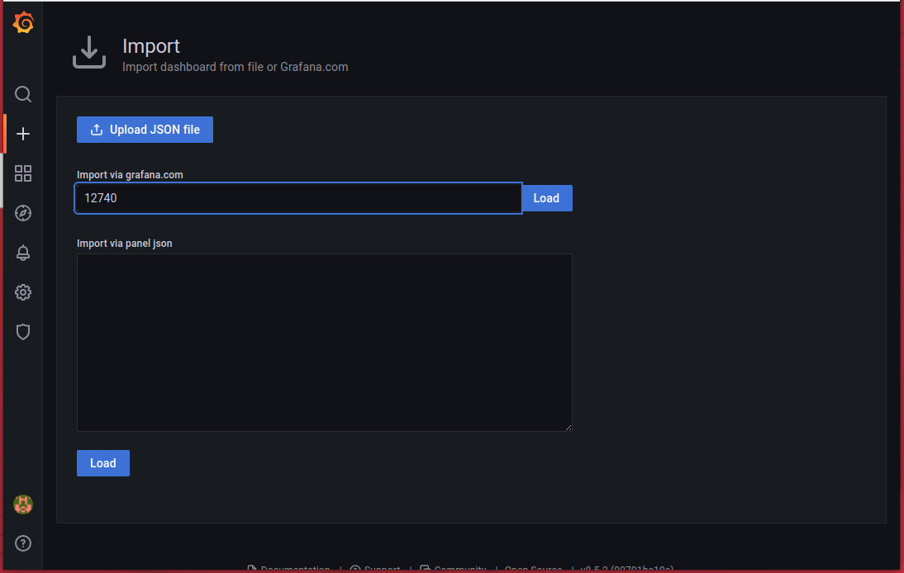

Selecione o seu data source do Prometheus e clique em "Import" no final da página.

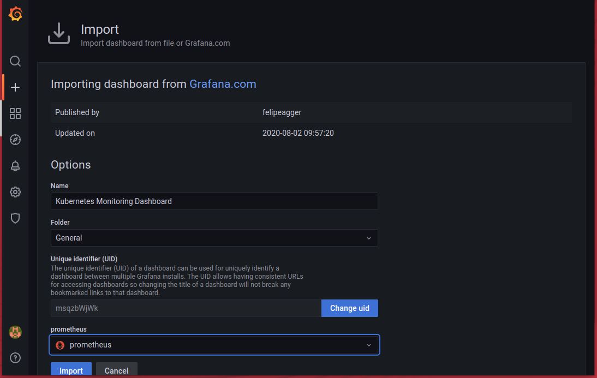

- Novamente no menu lateral esquerdo, no ícone de "mais"/"adição" (+), selecione "Import".
- Digite "12019" em "Import via grafana.com" e clique em "Load" para importar o Loki.
- Selecione os seus data sources do Loki e Prometheus e clique em "Import".

### Dashboard Robot Shop

- Copie todo o conteúdo do arquivo [robot-shop-dashboard.json](https://bitbucket.org/ciandt_it/sre-academy/src/main/robot-shop/dashboards/robot-shop-dashboard.json)
- No Grafana, no menu lateral esquerdo, vá no ícone de "mais"/"adição" (+) e selecione "Import".
- Cole o conteúdo do arquivo .json na caixa de texto abaixo de "Import via panel json" e clique em "Load"